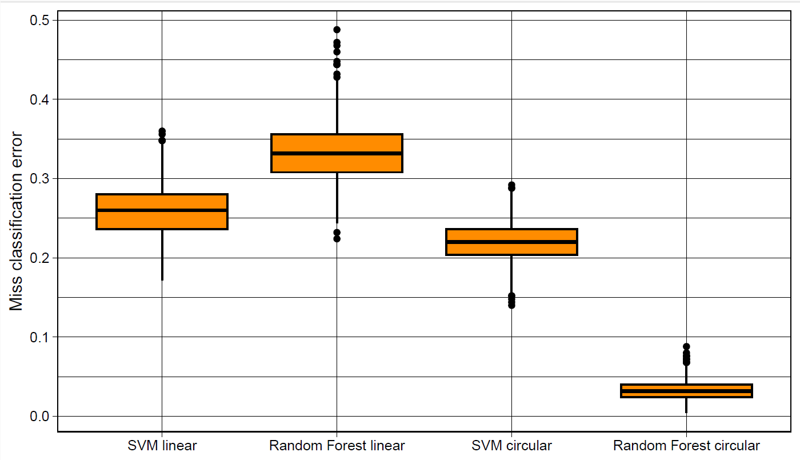
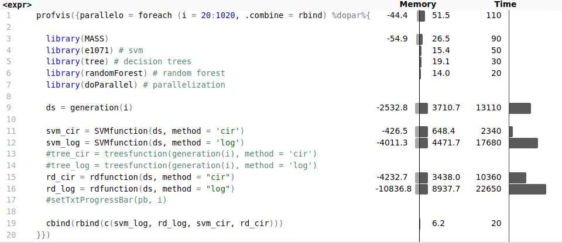

# Parallel Computing with R: Nonparametric Classification
Authors: 
- Bédouret Baptiste
- Cellitti Francesco
- Negroni Edoardo

## 1. Introduction
The goal of this project is to perform a reproducible simulation using parallel computing techniques. Specifically, we explore nonparametric classification methods, comparing two popular models: Support Vector Machine (SVM) and Random Forest. The objective is to determine which classifier performs best in terms of accuracy and computation time, through a series of simulations.

## 2. Data
### 2.1 Generation of Covariates
We generated 100 independent variables (X) using the mvrnorm function from R. With 500 observations, the matrix X has a dimension of 500 × 100.

### 2.2 Generation of Labels (y1 and y2)
- y1: A linear regression model was used to create the binary label. Probabilities were calculated using a logistic function.
- y2: For the more complex label, we used Principal Component Analysis (PCA) for dimensionality reduction, then a circular function was applied to compute the label.
## 3. Non-Parametric Classifiers
### 3.1 Support Vector Machine (SVM)
We applied SVM using three different kernel types:

- Linear
- Polynomial
- Radial
We tuned hyperparameters (C, gamma, and degree) using cross-validation in parallel. The results showed that for linearly generated labels (y1), the linear kernel was most effective, whereas for non-linear labels (y2), the polynomial kernel performed better.

### 3.2 Random Forest
Random Forest is an ensemble method based on decision trees. It uses Bootstrap Aggregating (Bagging) to improve the model's accuracy by averaging multiple trees. A key feature of Random Forest is the random selection of predictors at each tree split, which reduces variance and improves model reliability.

## 4. Parallelization and Results
We parallelized the simulation using the doParallel package, with 1000 replications for each classifier. The results highlighted that:

- For linearly generated labels (y1), SVM outperformed Random Forest.
- For non-linearly generated labels (y2), Random Forest performed better.
We measured the misclassification error and execution time for each method, noting that:

- The SVM with linear kernels had a lower error rate on linear data.
- Random Forest was more robust for non-linear data.

{:width="100"}
## 5. Profiling
Profiling of the SVM tuning process showed a significant reduction in computation time when parallelized. Without parallelization, the tuning process took 6 minutes 50 seconds; with parallelization, this was reduced to 1 minute 17 seconds. The total time for executing all algorithms 1000 times was 10.56 minutes, with Random Forest being the most computationally expensive.

{:width="100"}
